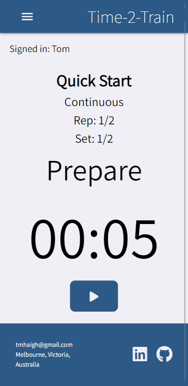
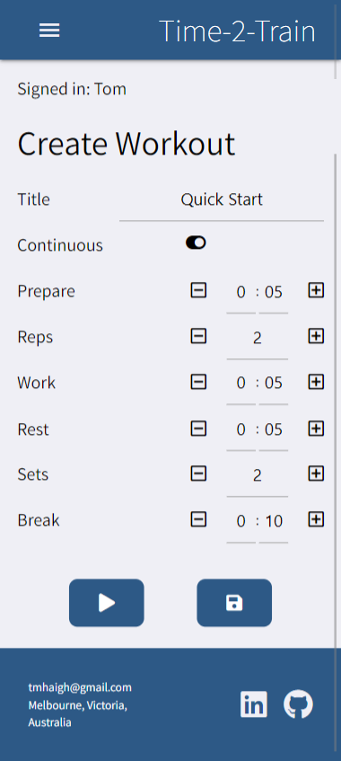
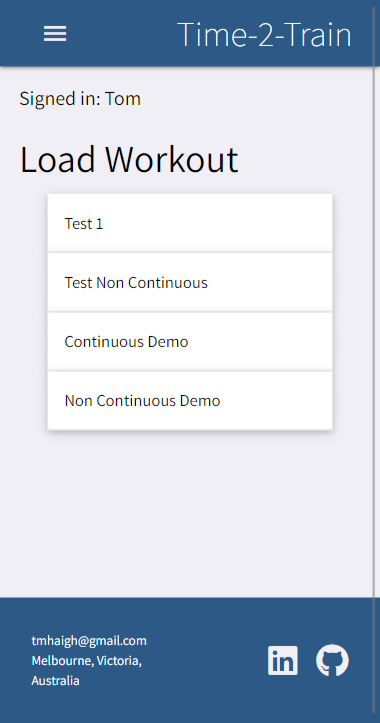

# Time-2-Train

   

## Description

A full-stack, React.js, PWA web product for fitness fanatics. Time-2-Train is a countdown timer for lovers of exercise who need to keep track of their reps, sets, breaks and rest periods of their workout. The timer can either be set to continuous mode for non-stop workouts or to non-continuous mode for exercises that may take an unknown time to complete eg. 10 pull-ups. User can log in with their Google accounts and they can create, save, load, edit and delete different configurations of the timer.

## Technologies

1) React.js
1) JavaScript
1) HTML
1) CSS
1) Materialize
1) PWA
1) API
1) MongoDB
1) Mongoose

## Deployed Link

https://time-2-train.herokuapp.com/

# Screenshots

## Contact

Got any questions? Please contact me at tmhaigh@gmail.com 
View my online portfolio https://conanas.github.io/ 
View my LinkedIn https://www.linkedin.com/in/thomas-m-haigh/
